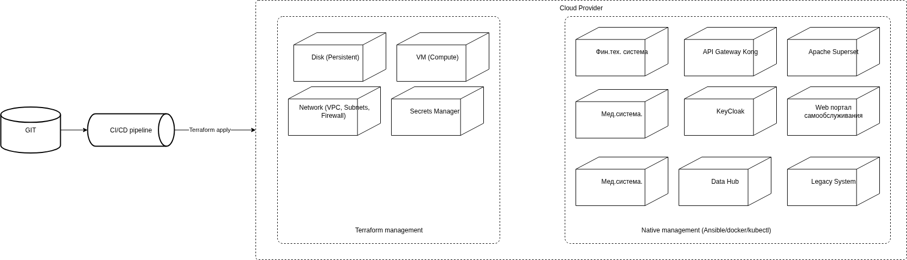
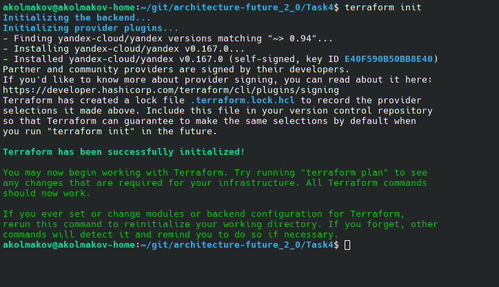
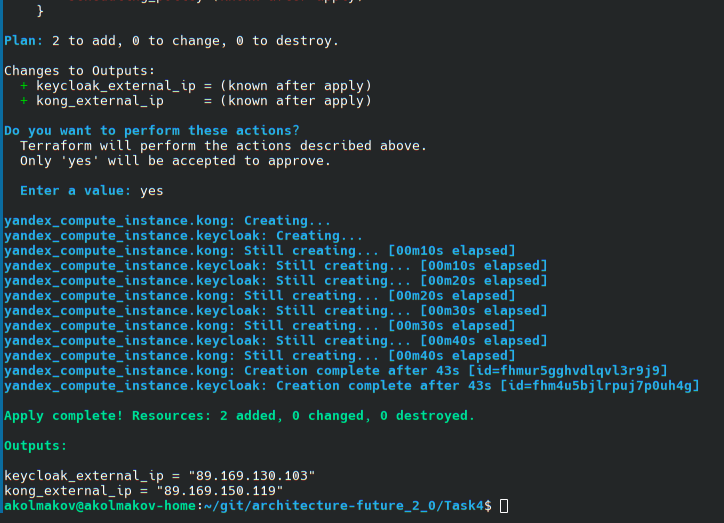

# Проектная работы 11 спринта

Важно. Так как в задании фокус на бизнес пользователях, данных и аналитике, все большие и сложные системы за пределами данного контекста мы представляем следующими блоками:

1. Медицинская система
2. Финтех система
3. ИИ система
4. Системы партнеров

## Задание 1. Проектирование целевой архитектуры и приоритизация проблем для поддержки ключевых бизнес-сценариев компании

В соответствии с заданием, требуется:

1. Спроектировать архитектуру через год
2. Описать проблемные места AS IS
3. Приоритезировать проблемы

Далее, детали в - [README](./Task1/README.md)

## Задание 2. Разделение системы на домены и моделирование потоков данных для поддержки ключевых бизнес-сценариев

В соответствии с заданием, требуется:

1. Разделить систему на домены
2. Отразить потоки данных между доменами (схема TO_BE будет урезана до размеров доменов)
3. Аргументировать логику разделения на домены

Далее, детали в - [README](./Task2/README.md)

## Задание 3. Разработка технологического радара и роадмапа изменений для поддержки бизнес-целей компании

В соответствии с заданием, требуется:

1. Сформировать технический радар
2. Составить RoadMap
3. Обосновать каждый этап отраженный в RoadMap

Далее, детали в - [README](./Task3/README.md)

## Задание 4. Проектирование облачной инфраструктуры с применением IaaS и Terraform 1

Диаграмма автоматизации развертывания:

/Task4/

main.tf — описание инфраструктуры;

variables.tf — определение переменных;

outputs.tf — вывод ключевых параметров;

terraform.tfvars — значения переменных;

**Результаты выполнения команд:**

terraform init:

terraform plan: [terraform_plan.txt](./Task4/terraform_plan.txt)

terraform apply: [terraform_apply.txt](./Task4/terraform_apply.txt)

Обоснование конфигурации: [justification.md](./Task4/justification.md)
