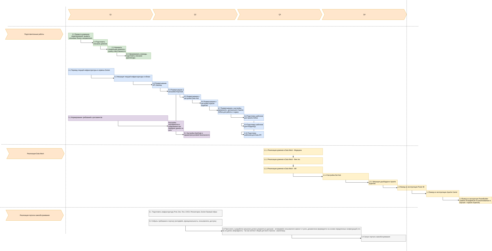

# Дорожная карта изменения в технологическом ландшафте компании

## Ответственные специалисты

Важно!

* Мы определяем команды по бизнес доменам
* В каждом бизнес домене присутствуют специалисты которые на 100% вовлечены в обслуживание только указанного домена

## ROADMAP

На основе проблем обозначенных в Task1 мы сформируем список задач, и далее, воспользуемся приоритетами из того же [Задания 1](../Task1/README.md) сформированными по принципу MoSCoW, сопоставим каждой из проблем - набор задач, для ее устранения:

| Номер проблемы | Наименование проблемы                                                                                                                                                                                                                                                                                                                                              |
| ----------------------------- | ---------------------------------------------------------------------------------------------------------------------------------------------------------------------------------------------------------------------------------------------------------------------------------------------------------------------------------------------------------------------------------------- |
| 1                           | Вся бизнес-логика и данные из разнородных доменов (медицина, финансы, персонал) завязаны на единый DWH на SQL Server 2008. Текущее решение плохо масштабируется.                                                                                                   |
| 2                           | Объем данных в сотни ТБ, множество трансформаций и сложных запросов приводят к тому, что отчеты строятся часами.                                                                                                                                                                          |
| 3                           | Используется «старая шина данных» на Apache Camel. При растущем количестве сервисов (Golang, Java, Python) это может создавать проблемы с надежностью и управляемостью интеграций.Критически низкая производительность.   |
| 4                           | SQL Server 2008 является устаревшей и неподдерживаемой версией, что представляет собой риски для безопасности и производительности. PowerBuilder — устаревшая клиентская технология. Устаревший технологический стек. |
| 5                           | Существующая BI-система завязана на DWH. Нет портала самообслуживания, где бизнес-пользователи могли бы самостоятельно строить отчеты.Отсутствие гибкой и масштабируемой аналитической платформы.                   |
| 6                           | В монолитном DWH смешаны данные разной чувствительности (медицинские, финансовые, персональные). Создание портала самообслуживания усугубляет этот риск.Используется «старая шина данных» на Apache Camel.             |
| 7                           | Отсутствуют четкие доменные границы.                                                                                                                                                                                                                                                                                                                   |

Задачи:

1. Вывод Legacy из эксплуатации:

   1. Вывод из эксплуатации MS SQL Server 2008
      1. Реализация доменов в Data Mesh - Медицина (ресурсы: DevOps+Архитектор)
      2. Реализация доменов в Data Mesh - Фин.тех.(ресурсы:DevOps+Архитектор)
      3. Реализация доменов в Data Mesh - ИИ (ресурсы:DevOps+Архитектор)
      4. Настройка Dat Hub (ресурсы: DevOps)
      5. Отключение синхронизации с Data Mesh, и удаление (ресурсы: DevOps)
   2. Вывод из эксплуатации Apache Camel (ресурсы: DevOps)
   3. Вывод из эксплуатации Power BI
      1. Миграция дашбордов в Apache SuperSet (ресурсы: DevOps + Аналитики)
      2. Отключение (ресурсы: DevOps)
   4. Вывод из эксплуатции PowerBuilder (замена интерфейсов на реализованные в портале + Apache Superset) (ресурсы: DevOps + Аналитики)(ресурсы: DevOps
2. Опредилить и внедрить доменные границы

   1. Назначить владельцев доменов и границ ответственности (ресурсы: Архитектор + Руководители компании)
   2. Провести доменное моделирование: выявить ключевые бизнес-направления. (см. [README Task2](../Task2/README.md) ) (ресурсы: Архитектор)
   3. Сформировать команды, подготовить описание архитектуры (ресурсы: Архитектор + Руководители компании и бизнес направлений)
   4. Подготовить описание доменов (ресурсы: Архитектор)
3. Разработать портал самообслуживания

   1. Собрать требования к порталу (интерфейс, функциональность, пользователи, доступы) (ресурсы: Функциональный аналитик + Архитектор + UI/UX специалист)
   2. Подготовить инфраструктуру Prod, Dev, Test, CI/CD, Репозитории, Docker базовый образ (ресурсы: DevOps)
   3. Приступить к разработке (решение должно управляться данными - интферфейс пользователя зависит от роли, динамически формируется на основе определенных конфигураций (что бы не делать микрофронты - так как контекст общий для всего портала - аналитика)) (ресурсы: специалист Backend, специалист Frontend, Функциональный аналитик, TeamLead, Архитектор)
   4. Запуск портала самообслуживания (ресурсы: Архитектор, TeamLead, DevOps)
4. Переход в облако и инфраструктурные работы (Реализация заданной архитектуры)

   1. Перевод текущей инфраструктуры в сервисы Docker (ресурсы: DevOps + Архитектор)
   2. Миграция текущей инфраструктуры в облако (ресурсы: DevOps)
   3. Развертывание API Gateway (ресурсы: DevOps)
   4. Развертывание и настройка KeyCloak (ресурсы: DevOps)
   5. Развертывание и настройка Data Hub (ресурсы: DevOps)
   6. Развертывание и настройка Apache SuperSet (ресурсы: DevOps)
   7. Развертывание и настройка временного, центрального Apache Airflow для работы с Legacy (ресурсы: DevOps)
   8. Подготовка шаблонов для Apache Airflow (ресурсы: DevOps + Архитектор)
   9. Подготовка шаблонов для PostgreSQL (ресурсы: DevOps + Архитектор)
   10. Подготовка шаблонов для Data API (ресурсы: DevOps + Архитектор)
5. Настройка параметров ИБ

   1. Настройка шифрования файловых систем (ресурсы: специалист ИБ + DevOps)
   2. Настройка KeyCloak и параметров ролевой безопасности (ресурсы: специалист ИБ + DevOps)
   3. Настройка сертефикатов и шифрования при передаче данных по сети (ресурсы: специалист ИБ + DevOps)
   4. Формирование требований и регламентов (ресурсы: специалист ИБ)

Строим связи задач с проблемами, и сортируем с ранее определенными приоритетами, это поможет обозначить этапы:

| MoSCoW      | Наименование проблемы                                                                              | Задачи                                                                                                                                                                                                                        | Комментарий |
| ------------- | ------------------------------------------------------------------------------------------------------------------------ | ------------------------------------------------------------------------------------------------------------------------------------------------------------------------------------------------------------------------------------- | ------------------------ |
| Must Have   | **[Проблема 4] Устаревший технологический стек (SQL Server 2008, PowerBuilder).** | 1.1 Вывод из эксплуатации MS SQL Server 2008                                                                                                                                                                     |                        |
|             | **[Проблема 7] Отсутствуют четкие доменные границы.**                          | 2. Опредилить и внедрить доменные границы                                                                                                                                                         |                        |
|             | **[Проблема 1] Монолитная архитектура DWH.**                                              | 2. Опредилить и внедрить доменные границы  4. Переход в облако и инфраструктурные работы (Реализация заданной архитектуры) |                        |
| Should Have | **[Проблема 2] Критически низкая производительность аналитики.**    | 4. Переход в облако и инфраструктурные работы (Реализация заданной архитектуры) 1. Вывод Legacy из эксплуатации                           |                        |
|             | **[Проблемa 6] Риски безопасности в монолитном DWH.**                               | 5. Настройка параметров ИБ 1. Вывод Legacy из эксплуатации                                                                                                                             |                        |
| Could Have  | **[Проблема 3] Проблемы со "старой шиной данных".**                                 | 1.2 Вывод из эксплуатации Apache Camel                                                                                                                                                                           |                        |
| Won't Have  | **[Проблема 5] Отсутствие портала самообслуживания.**                         | 3. Разработать портал самообслуживания                                                                                                                                                             |                        |

На всякий случай вспомним, какие были цели:

# Цели бизнеса

**Промежуточное состояние (через пару месяцев)**

* Архитектурное решение по трансформации сформировано и согласовано
* Границы доменов определены, а ключевые связи между ними описаны.
* В доменах запланированы конкретные проекты по развитию «витрины данных».

**Финальное состояние (через год)**

* Реализован портал самообслуживания.
* Бизнес-пользователи в доменах могут работать с данными в рамках новой архитектуры.
* На этом этапе допускается временное сохранение легаси-систем в отдельных доменах.

Не забываем про то что сам по себе вывод Legacy не является бизнес целью.

### Строим план работ:

Разберем этапы:

| Этап                                                             | Длительность | Комментарий                                                                                                                                                                                                                                                                                                                                                                                                                           | Обоснование                                                                                                                                                                                                                                                                                                                                                                                                                                                                     |
| ---------------------------------------------------------------------- | -------------------------- | -------------------------------------------------------------------------------------------------------------------------------------------------------------------------------------------------------------------------------------------------------------------------------------------------------------------------------------------------------------------------------------------------------------------------------------------------- | -------------------------------------------------------------------------------------------------------------------------------------------------------------------------------------------------------------------------------------------------------------------------------------------------------------------------------------------------------------------------------------------------------------------------------------------------------------------------------------------- |
| Подготовительные работы                        | Q1-Q3                    | Подготовительные работы включают как формирование команд, так и формирование документации, среды исполнения и перенос текущей инфраструктуры в облако + подготовка инфраструктуры для будущей разработки Data Mesh +Портал самообслуживания. | Создание технологического фундамента и основы для будущего решения. Успешно закрываются цели промежуточного состояния. Значительное повышение уровня безопасности и производительности текущего решения.                                                                                                  |
| Реализация Data Mesh                                       | Q3-Q4                    | Создаем базовый слой данных с необходимыми процессами, мигрируем старое решение на новое согласно сформированной архитектуре.                                                                                                                                                                                                       | По сути мы разрабатывем решение по работе с данными, гибкое, масштабируемое, производительное и производим миграцию со старого на новое. Ожидаем значительное увеличение производительности и стабильности. Снижение TTM. Тем самым решаем одну из бизнес  проблем. |
| Реализация портала самообслуживания | Q2-Q4                    | Начинаем работы как только появилась команда, разработка, задача сложная и чем раньше приступим, тем более вероятно что успеем без переработок вывести решение в Prod в заданные сроки                                                                                                      | Одна из целей бизнеса.                                                                                                                                                                                                                                                                                                                                                                                                                                                   |

Таким образом, мы построили диаграмму Ганта с планом работ который учитывает не только технологические потребности, но и критичность текущих проблем.
Разумеется, можно декомпозировать глубже, и предложить еще ряд важных работ, но кажется в представленное решение обозначает самые главные шаги.
